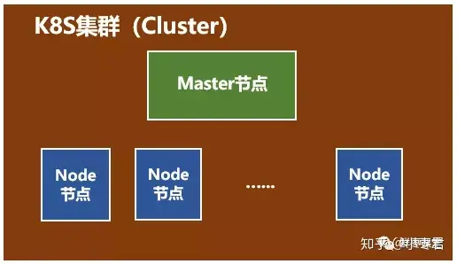
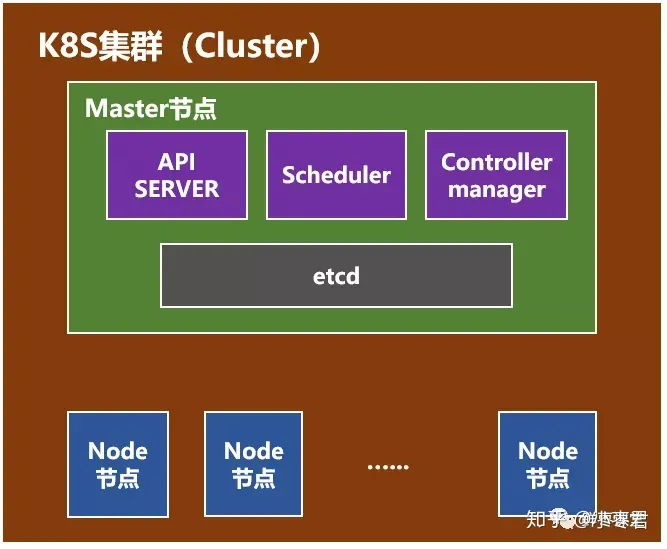
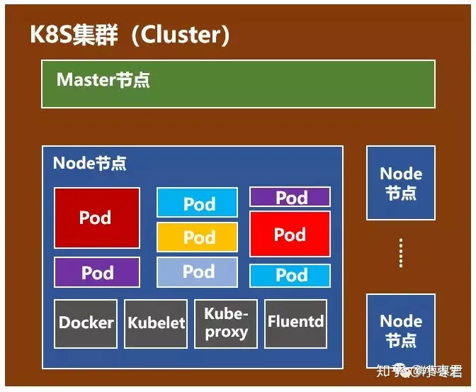

what is docker?

可以把已经构造好的环境复制出一个Docker镜像，通过Docker仓库，生成新的Docker容器。请注意，Docker本身并不是容器，Docker是创建容器的工具，是应用容器引擎。

Docker的核心概念：镜像（Image）、容器（Container）、仓库（Repository）

不是所有环境都允许被复制的，质量不合格的环境不允许被复制，所以引申出负责对Docker镜像进行管理的服务--Docker Registry服务，其中Docker Hub是官方默认的Registry公开服务，并拥有大量高质量镜像

但是Docker应用于企业级的具体实现相对困难，为了解决这个问题，对Docker及容器进行更高级更灵活的编排，k8s应用而生。它的全称是Kubernetes（舵手、领航员），k8s的前身是谷歌的Borg系统。

一个k8s系统，分为两个主要的部分：一个Master节点（主节点）、一群Node节点（计算节点）

Master节点介绍：

Api Server: 整个系统的对外接口，供客户端和其它组件调用

Scheduler：负责对集群内部的资源进行调度

Controller Manager：负责管理控制器，监视集群中的对象状态

etcd：集群状态的存储中心，是一种高可用的分布式键值存储系统

Node节点介绍：

Pod：k8s最基本的操作单元。一个pod代表集群中一个运行的进程

Docker：前面讲过，不赘述

Kubelet：负责监视当前节点上的pod

Kube-proxy：负责为pod提供代理

Fluentd：负责日志收集，存储与查询
