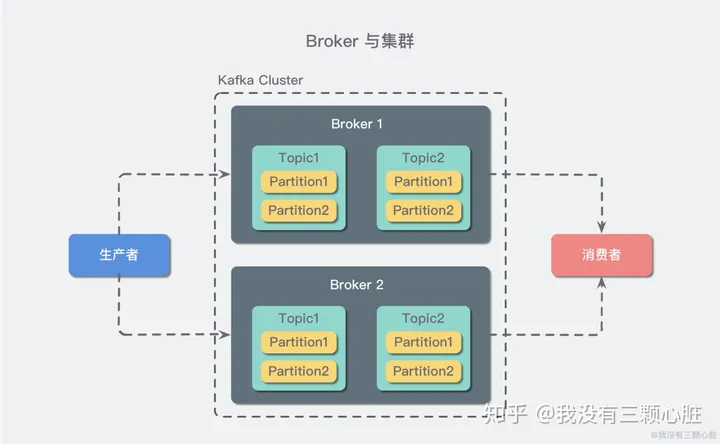

what is kafka?

一种分布式的，基于发布/订阅的消息系统

kafka组成：

Kafka里面有很多Topic，每个Topic代表一个消息队列。为了提高吞吐量，引入partition概念，一个Topic允许有多个partition以提高吞吐量

一个Kafka服务器也称为Broker。Broker可以接收生产者发送的消息并存入磁盘，并同时服务消费者拉取partition消息的请求，返回目前已经提交的消息。多个Broker称为Cluster

我们还可以针对主题做个性化的保留策略（retention）。譬如只保留一段时间或特定大小的日志。当超过限制后，老的会被删除，也可以针对topic设置单独的过期策略

Topic只是逻辑上的概念，实际上物理存储的是partition，每一个partition对应一个目录，存储消息和索引文件

Segment是Kafka文件存储的最小单位。segment是索引文件，文件后缀名为.index

kafka创建topic有个坑：在启动kafka之前要安装zookeeper，新版本不支持命令带--zookeeper参数，要带--bootstrap-server

正确示例：

kafka-topics.bat --create --bootstrap-server localhost:9092 --replication-factor **1** --partitions 5 --topic aurora\_test

错误示例：

kafka-topics --create --zookeeper localhost:2181 --replication-factor 1 --partitions 1 --topic test
